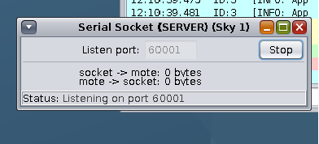
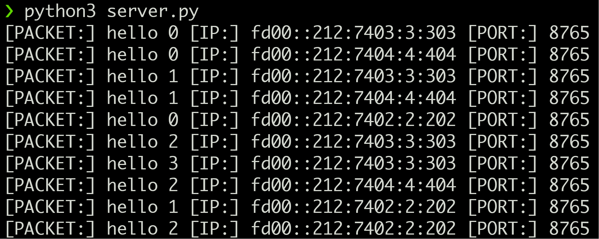

## Contiki-NG Cooja communication with external Python server

This example shows a very basic way to connect Cooja simulator UDP motes to an external
Python server. To build more complex applications, the packets can hold more data.

### Files

1. `server.py` Python server communicates with internal simulation network.
2. `udp-client.c` Contiki-NG UDP client firmware, to compile it, place the file inside
   `contiki-ng/examples/rpl-udp` directory, and run `make TARGET=sky udp-client`.

### Compiled firmware files

Below files are taken directly from `contiki-ng/examples/`, only present in this
repository for convenience.

1. `sky/border-router.sky` Compiled border-router for sky target.
2. `sky/udp-client.sky` Compiled udp-client that already has the patch with the
   destination IP address pointing to border-router.

### Steps

1. Setup Contiki-NG project with either [Docker](https://docs.contiki-ng.org/en/develop/doc/getting-started/Docker.html) or natively on [Windows](https://docs.contiki-ng.org/en/develop/doc/getting-started/Docker.html) or [Mac](https://docs.contiki-ng.org/en/develop/doc/getting-started/Docker.html#on-macos). 

2. Compile `contiki-ng/tools/serial-io/tunslip6.c`. It creates the executable `tunslip6`
   inside the same directory.

```sh
cd contiki-ng/tools/serial-io
make tunslip6
```

3. Compile `contiki-ng/examples/rpl-border-router` for `TARGET=sky`. It creates the
   contiki firmware `border-router.sky`, or take the `sky/border-router.sky` from this
   repository (Same file, already compiled).

```sh
cd contiki-ng/examples/rpl-border-router
make TARGET=sky
```

4. The client that sends requests to the python server is from
   `contiki-ng/examples/rpl-udp/udp-client.c`. By default, the script requests for the
   destination address, but it needs to be set to a fixed address, i.e. The address of the
   border router. For this tutorial I set the IP address in the `udp-client.c` to `fd00::1`
   . This is done by applying the patch below. For ease there is a copy of `udp-client.c` 
   with this patch already applied. So it can be copied and compiled by running the command 
   `make TARGET=sky`.

```
-    if(NETSTACK_ROUTING.node_is_reachable() &&
-        NETSTACK_ROUTING.get_root_ipaddr(&dest_ipaddr)) {

+    uip_ip6addr(&dest_ipaddr, 0xfd00, 0, 0, 0, 0, 0, 0, 1);
+    if (NETSTACK_ROUTING.node_is_reachable()) { 
```

4. Start Cooja Simulator.

From Unix.

```sh
cd contiki-ng/tools/cooja
./gradlew run
```

From Windows.

```sh
cd contiki-ng/tools/cooja
./gradlew.bat run
```

5. Inside the cooja simulator
    * Create a new simulation
    * From toolbar `Motes` > `Add Motes` > `Create New Mote Type` > `Sky Mote`.
    * In the opened window, click on `Browse`, and select the above compiled
      `border-router.sky` firmware.
    * In the network window, `Right click` on the newly created node, from the menu opened
      Select `Mote tools for` >  `Serial Socket (SERVER)`. It opens up another window
      named `Serial Socket (SERVER)`, inside that window click on `Start` button. This
      starts the serial socket server on `127.0.0.1:60001`. This address is used in the
      next steps by `tunslip6`.



6. Start the `tunslip6` program, by running the command. Checkout [Program
   descriptions](#program-descriptions) for more details about `tunslip6`.
```sh
sudo ./tunslip6 -a 127.0.0.1 -p 60001 fd00::1/64
```

7. Start the python server. The python server by default listens on the IP address
   `fd00::1` and port `5678`. `5678` port number is by default assigned to the
   udp-server.c in the examples, Therefore, the same port number was kept for the python
   script.

8. Inside the cooja simulator.
    * From toolbar `Motes` > `Add Motes` > `Create New Mote Type` > `Sky Mote`.
    * In the opened window, click on `Browse`, and select the above compiled
      `udp-client.sky` firmware.
    * Create as many number of udp-client motes as required.
    * Start the simulation.

### Results


***Sample Output from Python server***

### Program descriptions

1. `tunslip6` It creates a virtual tunnel interface on the OS. This helps link the
   internal network from inside Cooja, to the outside network. 

`NOTE:` By default the IP address assigned to `tunslip6` through CLI arguments should be
destination IP address for the nodes inside the simulated network. For more details,
checkout step 4 above.

* Compile `tunslip6` binary.
```sh
cd contiki-ng/tools/serial-io
make tunslip6
```

* Execute `tunslip6`.
```sh
sudo ./tunslip6 -a 127.0.0.1 -p 60001 fd00::1/64
```

`-a` Address flag specifies the Socket server address, in this case `localhost (127.0.0.1)`.
`-p` Port flag specifies the Socker server port, the default port is `60001`.

The third argument is the IP address to assign `fd00::1/64` is the address of the border
router. This address is used by the internal simulation nodes, to communicate with the
border-router.

`NOTE` If the IP address is changed from `fd00::1/64`, Change it in `server.py` and 
